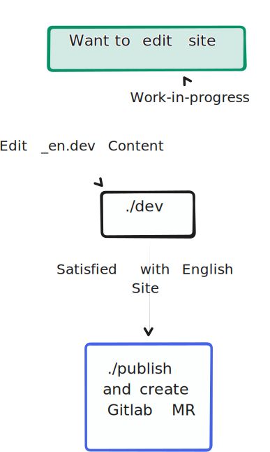
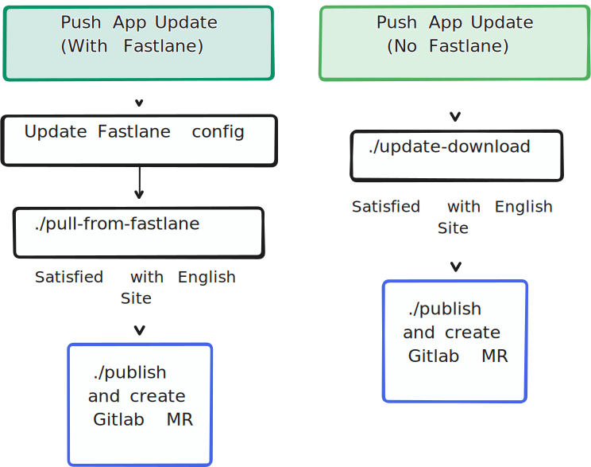
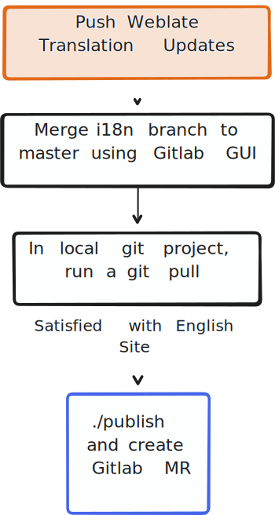

This is the website for [Ceno Browser](https://censorship.no) - a web browser designed to circumvent censorship by routing traffic through intermediate ephemeral nodes (bridges).

Once the content is in the censored zone - and if it's not private - it is then further distributed by those nodes in a BitTorrent-like fashion.

## Project Structure

`_en.dev/` - The main folder to make local edits, this is the root of the site generation

`_en.src/` - Automatically created from the `_en.dev` directory, this is the source of all the `.po` template files

`_{lang}.src/` - Automatically generated using the `.pot` files in `_en.src` plus the included `.po` files included in the directory

`img/` - For static visual assets

`css/` - For all relevant styling assets

`_{lang}.overwrite` - Contains overwrite files, any top-level html tags in this directory will override tags with matching ids in files with a matching name. For example, given the following file, `_es.overwrite/test.html`:

```html
<div id="ReplaceThis">
    Content
</div>
```

This will replace the first div with id "ReplaceThis" in the `_es.src/test.html` file with `Content`.

### Template Files

`$card.html` - Template for generating preview cards for markdown files

`$download.html` - Template for the application download section of the website. This template is loaded in wherever `$DOWNLOAD` is used inside of files located in the dev directory

`$metadata.html` - Template used for pulling metadata from markdown files, you likely won't need to modify this file.

`$template.html` - Template used for generating html files from the markdown entries found in the dev directory.

## Contributing

This website is hosted by GitHub Pages and content is authored in HTML.

### Setting Up the Development Environment

This step is optional, but will likely lead to the most pleasant development experience while using `eq-web`.

The recommended development setup is using the [VSCodium IDE](https://vscodium.com/) and adding the [VSCode live server plugin](https://github.com/ritwickdey/vscode-live-server). 

### Using the Live Server

Go into any of the plain {lang} directories, the common case is to view the English site in `en`, then right-click on the file you want to preview, let's say `index.html`, then select "Open in Live Server". VSCodium should now open a localhost tab in your browser of choice.

### Editing Lifecycle






## Additional Resources

- [Ceno Browser Branding & Style Guide](https://censorship.no/en/branding.html)
- [Ceno Browser project on Weblate](https://hosted.weblate.org/projects/censorship-no/)

## License

This source code is subject to the terms of the [Creative Commons Attribution-ShareAlike 4.0 International License](LICENSE.md).

## Feedback

We welcome both positive and negative feedback, bug reports and feature requests, as well as questions at support@censorship.no.
Our PGP key fingerprint is: 51BE 600C 2711 926C 865D F93F C7DC C123 F0DD B862
